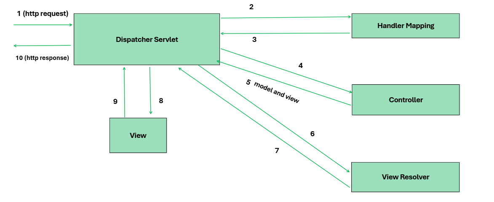

# Spring MVC

# Spring MVC 

## Introduction
**`What is MVC?`** --> Spring MVC is a web framework within spring framework that simplifies http request and response.
MVC follows model-view-controller, it separates app into three component `-->` model , view and controller.

## Feature Of Spring MVC
- **`DispatcherServlet`:** Acts as fron controller for spring app that manage http request and response .
- **`Handler mapping`:**  Maps incoming requests to appropriate controller methods based on configured URL patterns.
- **`Controller`:** Handle user requests, process input, and interact with the model to prepare data for the view.
- **`Handler mapping`:** Maps incoming requests to appropriate controller methods based on configured URL patterns.
- **`View resolver`:** Resolves logical view names returned by controllers to actual view implementations (e.g., JSP, Thymeleaf templates)
- **`Model`:** encapsulate business logic and data controller use model to pass data to view.

## How does Spring MVC work? 
### `MVC Archeticture`

1. when http request is made to spring MVC App  go to dispatcher servlet .
2. Dispatcher servlet consult the handler mapping .
3. Handler mapping determine appropriate controller for request.
4. Selected controller process the request ,controller create a model based on user request 
5. Controller return the model to Dispatcher servlet (the front controller).
6. Front controller passes this model to view templates 
7. return logical view name.   
8. use the view resolver to find view.
9. render the response.
10. send response to the client
